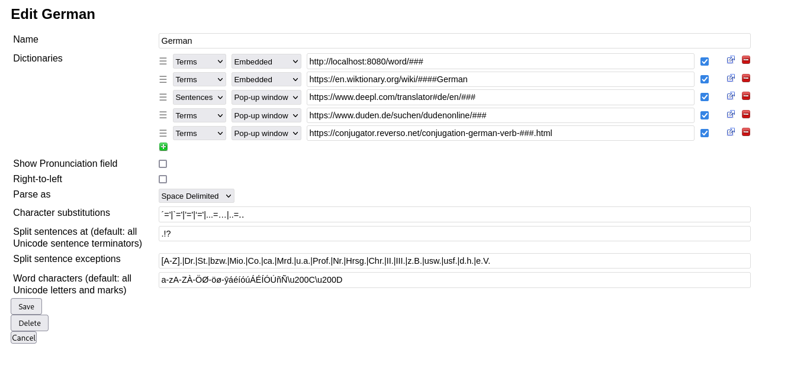

# Multinary For Lute

# What is this?
A hacky webserver that embeds multiple dictionaries onto one html page after it resolves page path. It extends functionality by making dictionaries on [Lute V3](https://github.com/LuteOrg/lute-v3) load asynchronously. This save seconds and clicks every word.

# Looks like this


# How do i set this up?
Tell lute to go to the webserver like this.


Then run `go run main.go`.


# How do I change the settings?

Pick up a shovel and edit the source! For example, you can change or add dictionaries by looking in the main function.

```golang
func main() {
	elements = add_website_to_elements(elements, "https://www.dwds.de/wb/")
	elements = add_website_to_elements(elements, "https://www.dict.cc/?s=")
	elements = add_website_to_elements(elements, "https://context.reverso.net/translation/german-english/")

	http.HandleFunc("/word/", view_handler)
	log.Fatal(http.ListenAndServe(":8080", nil))
}
```

The order elements are appended is the order they appear in html.
